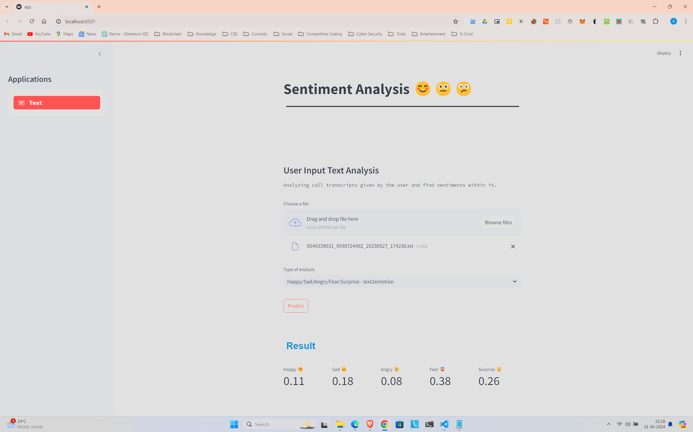
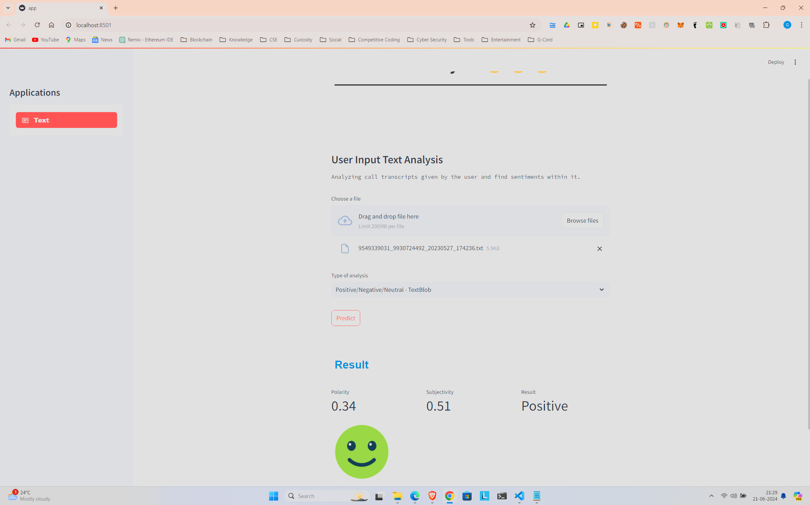

# Sentiment Analysis for Call Transcript App

This project is a web application designed to analyze the sentiment of call transcripts. The application is built using Streamlit for the user interface and Flask for the backend server. The sentiment analysis is performed using a machine learning model.

## Features

- Upload call transcript files (text files).
- Analyze the sentiment of the uploaded transcripts.
- Display sentiment analysis results including positive, negative, and neutral sentiments.
- User-friendly interface built with Streamlit.
- Efficient backend processing with Flask.

## Technology Stack

- **Streamlit**: For building the interactive user interface.
- **Flask**: For handling backend API requests and processing.
- **Python**: Programming language used for building the app.
- **Libraries for sentiment analysis**: textblob, nltk(vader), flair, text2emotion, fer

## To run the app

```bash
https://github.com/theBatman07/SentimentAnalysis.git
cd SentimentAnalysis
```

```bash
python -m venv venv
source venv/bin/activate # on Windows venv/Scripts/activate
```

```bash
pip install -r requirements.txt
```

```bash
streamlit run app.py
```

```bash
python flask_app.py
```
## Screenshots
<div>
    
    
</div>